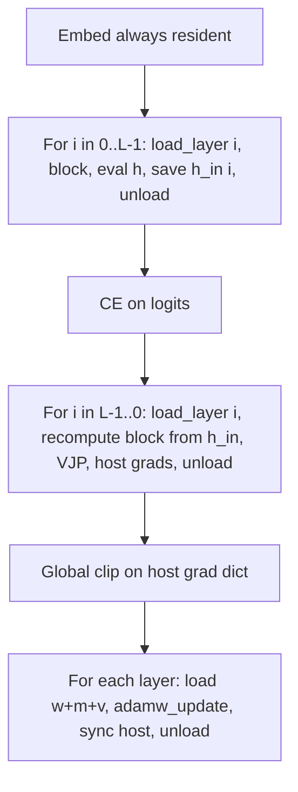

# Phase 1 layer streaming (2 GB)

True backprop cannot update layer `i` until `d_h` exists from layer `i+1`. **Do not** run Adam in the forward loop. The live step is: stream-forward (save residual checkpoints) → loss → stream-backward (recompute block, VJP) → global clip on host grads → stream Adam.

Host NumPy already holds every weight (see [`model/weights.py`](model/weights.py)). Streaming only drops **Metal** copies of idle layers and moves idle Adam `m/v` to host. That is what the 2 GB `mx.get_active_memory()` abort actually sees. Idle host tensors still sit in unified DRAM (~300 MB for L=32 C=256); that is fine. `np.memmap` is out of scope (Phase 1.5 if params themselves approach 2 GB).

## Trap: fused next-layer LN1

Current GPU forward applies **layer i+1’s `ln1_gamma`** at the end of layer i (`pending_ln1` in [`model/gpt.py`](model/gpt.py) ~318–324). That requires two layers resident. The stream path must be a self-contained block:

- Save `h` after `h + s * mlp` (use existing [`layers.add_residual`](model/layers.py)), `mx.eval(h)`, unload i.
- Layer i+1 starts with its own LN1 on that `h`.

Same math as today, delayed until the next block is loaded. Keep the fused path for `layer_strategy=resident` so L=6 tok/s does not regress.

## Weight / Adam API

[`model/weights.py`](model/weights.py)

- `always_resident_keys`: `token_embedding`, optional `position_embedding`, `final_ln_*`, `lm_head_bias` (tied `lm_head` remains a view).
- `layer_keys(i)`: `layer_{i}.*`
- `upload_to_device()`: if streaming, upload **only** always-resident; else current behavior.
- `load_layer(i)` / `unload_layer(i)`: `to_device` / drop dict entries + `mx.eval` leftover stream.
- **ScratchPool hygiene (critical):** every `unload_layer` must call `scratch_pool.clear()`. Named temps (`layer_0.qkv`, attn scratch, etc.) outlive dropped weight dict entries and will pin Metal memory across depth if the pool is not cleared.

[`training/gpu_optimizer.py`](training/gpu_optimizer.py)

- Streaming: `m`/`v` are host `np.ndarray` for layer keys; device copies exist only while that layer is loaded.
- Always-resident keys keep device `m`/`v` as today.
- `step_layer(i, grads_i)` after **one** `t += 1` per optimizer step (not per layer).
- `sync_host_weights` already used at checkpoint; after each layer Adam, write w and m/v back to host before unload.

**Global grad clip on the host grad dict** after the full streaming backward (not per-layer, not mid-backward). That keeps the Metal backward simple and matches today’s global L2 clip. Then stream Adam. Microbatch accum stays on host too so [`train.py`](train.py) `_accumulate_grads_` does not keep L layers of device grads. `summarize_layer_grad_norms` reads the same host dict.

## Forward / backward

Extract `_block_forward(i, h) -> (h_out, layer_cache)` and `_block_backward(i, d_h, layer_cache) -> (d_h, grads_i)` from the existing GPU loop so resident and stream share one VJP.

**Stream forward:** embeddings resident; for each i, `load_layer(i)`, block, keep only `h_in[i]`, drop attn/MLP caches, `eval_for_host(h)`, unload. Then `final_ln` + `lm_head`.

**Residual checkpoints stay on device** (default). At L=48, B=4, T=256, C=256 that is ~48 MB and avoids host round-trips on backward recompute. Fallback (not Phase 1): move `h_in` to host if someone later combines extreme L with large B. Document that in README.

**Stream backward:** LM-head + final LN VJP (resident). For i reversed: load i, **recompute** block from `h_in[i]` (reuse the checkpoint recompute already in `_attention_backward_batch_gpu` / `_mlp_backward_gpu`), VJP, `eval` `d_h`, copy grads to host, unload. Embed VJP last.

**Generate is mandatory in Phase 1, not a follow-up.** Prefill (`_prefill_kv`) and decode (`_decode_kv` / host fallback) must call `load_layer` / `unload_layer` per block. Forgetting this means L=32 generate uploads the full stack and trips the 2 GB abort even if train streaming works. KV arenas stay allocated (L×2×T×C ≈ 24 MB at those shapes).

## Memory controller

[`training/memory_controller.py`](training/memory_controller.py): `layer_strategy`: `resident` | `stream`.

Stream Metal estimate (refuse only if this overflows usable ~1.74 GB):

- always-resident weights + Adam
- **one** block weights + Adam + grads
- one-layer attn working set (`B*H*T*T`) + MLP hidden
- residual checkpoints `L*B*T*C` (or 1× if checkpoints go host)
- logits `B*T*V`

Autoscale order: current knobs first; if still over, set `stream` + `eval_per_layer` **before** shrinking T. `--no-layer-stream` keeps today’s refuse. `--layer-stream` forces it (for L=6 bring-up).

Config: [`model/config.py`](model/config.py) `layer_strategy` (default `resident`). CLI in [`cli_common.py`](cli_common.py).

## Tests and docs

- Logits + grads: tiny C/H/T, L=2/4, stream vs full-resident, same seed, `assert_close` like [`tests/parity/test_modern_step.py`](tests/parity/test_modern_step.py).
- `load_layer` / `unload_layer`: Metal keys only always-resident + one prefix; host weights unchanged.
- Controller: L=32 C=256 B=4 T=256 stream estimate `<` 2 GB; same recipe without stream still over without other knobs.
- Smoke: one train step L=8 stream under the abort (`check_memory` after each layer).

Docs: README / CHANGELOG **0.0.5** (0.0.4 is the controller-only release). State 2–4× tok/s hit and fanless thermal throttle. Residual scale `1/√(2L)` stays mandatory for deep stacks.

## Out of scope (Phase 2+)

Prefetch / keep 2–4 hot layers, async copies, memmap Adam, activation offload of `h`, per-projection streaming, multi-process pipeline parallel.

## Suggested bring-up

Matches implementation order (do not skip generate):

1. Weight + Adam API (`load_layer` / `unload_layer` + `step_layer` + `scratch_pool.clear`)
2. Extract clean `_block_forward` / `_block_backward` (no `pending_ln1` on stream path)
3. Stream forward logits parity vs resident
4. Stream backward grad parity vs resident
5. Wire into `train.py` (host clip then stream Adam) **and** generate prefill/decode
6. Controller + CLI (`--layer-stream` / `--no-layer-stream`); stream before shrinking T
7. Tests + docs (CHANGELOG **0.0.5**; residual-checkpoint device default + host fallback note)

Optional later: `setup/story_c256_l32_stream.json`. Do not point the live `run8+16` L=6 job at it.

## Review findings (folded in)

Full pass over train/generate/optimizer/clip. These are Phase 1 requirements, not follow-ups.

### Unify on the self-contained block (resident too)

`residual_rmsnorm_with_cache` already returns `(x_out, y, xhat, inv)` with `x_out = x + s*branch` and `y = RMSNorm(x_out, gamma)`. Today `pending_ln1` is just `y` computed with **next** `ln1_gamma` at the end of layer i. Delaying that RMSNorm to the start of layer i+1 is the same two ops.

**Use one unfused `_block_forward` / `_block_backward` for both resident and stream.** Op count matches fusion; one VJP; parity is actual equality, not “close enough.” Last layer: `add_residual` then always-resident `final_ln` (same as today’s `residual_rmsnorm(..., final_ln_gamma)`).

### Generate: pack KV before unload

Prefill is `forward` then [`build_device_kv_state`](model/mlx/kv_cache.py) reads `cache["layers"][i]["attn"]["k_d"]`. Stream forward drops those on unload. **During each stream block, pack K/V into the layer arena, then drop attn caches.** Decode [`_decode_kv_device`](model/gpt.py) has the same `pending_ln1` loop over `dw[layer_i]` — wrap with `load_layer`/`unload_layer`. Disable CUDA-graph decode when streaming (`_try_setup_decode_graph` captures weights).

### Clip / accum are Metal-only today

[`AdamWGPU.clip_grads_`](training/gpu_optimizer.py) calls `cuda_ops.grad_global_norm_sq` (needs `.mx`). Host NumPy clip already exists on [`training/optimizer.py`](training/optimizer.py) `AdamW.clip_grads_`. Stream path: all grads on host after backward; use that NumPy clip (or teach `clip_grads_` to branch). [`_scale_grads_`](train.py) / [`_accumulate_grads_`](train.py) already have a NumPy branch (`g *=` / `+=`); DeviceArray uses `.mx` not `gpudata` — stream avoids the mixed case by staying host-side for layer grads.

`summarize_layer_grad_norms` already supports NumPy grads.

### Adam step split

`t += 1` **once** per optimizer step (`begin_step`), then `step_layer(i)` L times plus `step_resident()` for embed/final_ln (still device m/v). After each layer update: `sync_host_weights(layer_keys)` and host m/v, then unload. Checkpoint [`save_checkpoint`](training/checkpoint.py) reads host `all_params()` — resident embed/ln must be synced before save (train already calls `sync_host_weights` at checkpoint; keep that).

### Prefill KV + residual `h_in`

Keep `h_in[i]` on device (~48 MB at L=48 B=4 T=256 C=256). Backward recomputes the block from that tensor. Do not also keep attn scores.

### Metal free timing

Dropping Python refs is not enough. `unload_layer`: delete device dict entries, `scratch_pool.clear()`, `eval_for_host(h)` (already have the stream), then if MLX exposes it, `mx.synchronize()` / clear cache. Smoke test: `check_memory` after each layer. Train loop does not `check_memory` per layer (too slow); keep existing log-every checks.

### Controller dataclass

Add `layer_strategy` to `MemoryPlan` / `memory_plan` JSON. Stream estimate must include **all L residual checkpoints on device** plus KV arenas on generate.

### Files (expected)

- [`model/weights.py`](model/weights.py), [`training/gpu_optimizer.py`](training/gpu_optimizer.py), [`model/gpt.py`](model/gpt.py)
- [`training/memory_controller.py`](training/memory_controller.py), [`model/config.py`](model/config.py), [`cli_common.py`](cli_common.py), [`train.py`](train.py)
- [`tests/test_layer_stream.py`](tests/test_layer_stream.py) (new) + small parity in existing modern-step style
- README, CHANGELOG (0.0.5), `py_calls.md`

Do not touch the running `run8+16` L=6 job or raise the 2 GB cap.

