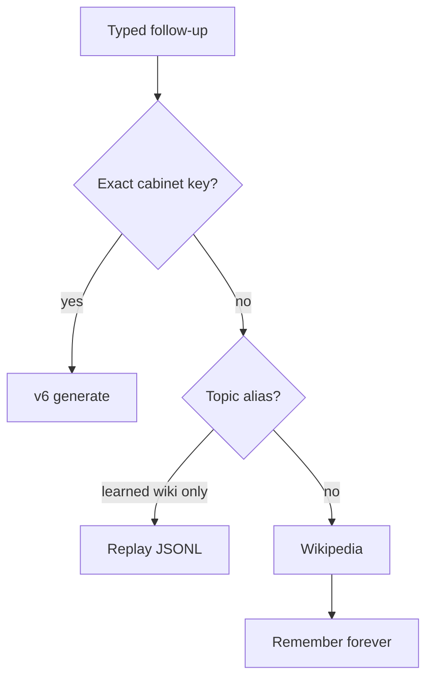

# Linked / related questions: data, router, product

It is **all three**. The screenshot is not one bug.



After `What is the capital of France?` the weights only know that **one** string. `Where is Paris?` and `largest city of France` are different keys, so the router leaves the cabinet. Wikipedia then answers a different article and freezes it. Relatedness never exists as a first-class object.

**Hard constraints stay:** no fuzzy match across the whole cabinet (unobtanium must not hit Neonics), no wiki text into the GPT, one checkpoint / 2 GB, do not `--resume` v6 into a new mix.

**Ship order:** router + product on **v6** (same day). Data + **v7** when you want those follow-ups to *generate*. Other on the first-move question is treated as this split.

---

## Diagnosis

### Data

[`tools/wikidata_to_facts.py`](tools/wikidata_to_facts.py) emits one template per capital:

```text
What is the capital of {country}?
The capital of {country} is {capital}.
```

Paris is only an **answer token**, not a question. There is no `Where is Paris?`, `What country is Paris in?`, or `What is the largest city of France?`. Same for inventors / elements: one Q per entity.

v6 is 490 unique × 20. The net can recite a locked line (France, Neonics) and still drop a token (Parsons). It cannot invent a linked Q it never saw.

### Router

[`training/router.py`](training/router.py) `route()` is stateless: exact [`normalize_question`](training/cabinet_index.py) → topic alias **only for learned wiki rows** → calc → Wikipedia → miss.

It does not remember that the last generate was France/Paris. Trained topic aliases (`what is neonics` → `Tell me about Neonics.`) were never added. Wikipedia is the default for any leftover What/Where.

### Product

The UI is one thread with chips. Users read that as one model. `cabinet · generate` then `search · wikipedia` is two products. Clicking a related question is not offered. A bad wiki line in [`output/cabinet_learned.jsonl`](output/cabinet_learned.jsonl) becomes the next “answer” with no Metal.

---

## Improve the router (this pass, v6)

Add a **closed-world link index** on trained facts only. Not embedding search. Not substring over 4910 keys.

1. When loading the cabinet ([`load_index`](training/chat_session.py)), parse entities from trained pairs:
   - Capitals: `capital of {country}` + `{city}` from the assistant.
   - Same idea for `Who invented X?` / atomic-number templates already in the mix.
   - Store `entity → [CabinetFact]` and `fact → frozenset(entities)` on [`CabinetIndex`](training/cabinet_index.py).
2. Session state on [`ChatSession`](training/chat_session.py): `last_entities` after a **generate** hit. Clear on `:clear` / New chat. Do not seed from wiki replay.
3. New lookup **before** Wikipedia, after exact/topic:
   - Collect candidate facts that share an entity with `last_entities` **or** with entities mentioned in the typed text (entity keys are the closed set).
   - Hit only if the typed question matches a **known template** on that entity (`where is {city}`, `what country is {city} in`, `capital of {country}`, …) **and** that fact exists in the index.
   - 0 matches → do not guess. 2+ matches → do not guess (product lists them).
4. After a generate turn, **do not auto-Wikipedia** on the next fact-shaped miss. Return `miss` + `related` prompts. Wikipedia stays on `:search`, or when there is no session topic (cold start).
5. Give **trained** facts the same topic aliases learned rows already get (`tell me about neonics` / `what is neonics` → generate). Still exact-after-normalize, not fuzzy.

Tests in [`tests/test_router.py`](tests/test_router.py) / [`tests/test_cabinet_index.py`](tests/test_cabinet_index.py):

- France generate, then `where is paris?` → generate the **Paris** fact if present; if absent, miss + related `[What is the capital of France?]`, **no** Wikipedia.
- `What is unobtanium` still misses / searches; never hits Neonics or France.
- Cold `where is paris?` with no Paris question in the mix → miss + related empty or search only if no last generate (keep current cold-start wiki if you want; default: miss+related after a cabinet turn, wiki on cold start).

---

## Improve the product (this pass, same PR)

Relatedness has to be visible or users will keep thinking Wikipedia is the model.

1. Extend [`TurnResult`](training/chat_session.py) + [`webui.py`](webui.py) `/api/chat` with `related: string[]` (exact trained user questions, max ~5).
2. [`webui/templates/index.html`](webui/templates/index.html): chips under a generate/miss turn. Click sends that exact string (cabinet generate).
3. Miss copy after a cabinet turn: `Not a trained follow-up. Ask one of these, or :search.` Stop dumping a commune list into the thread.
4. REPL: print related lines; `:related` reprints; `:search q` unchanged.

Do not persist wiki on these related misses. The poisoned `largest city of france` line is already gone; keep skipping list-pages in [`tools/wiki_search.py`](tools/wiki_search.py).

---

## Improve the data (follow-up, new mix → v7)

Router can only generate a follow-up that **exists**. Add linked Qs in [`tools/wikidata_to_facts.py`](tools/wikidata_to_facts.py) (and the elements/inventors verbalizers) when building the next mix:

For each capital pair, unique questions (same answer style, short):

- `What is the capital of {country}?` (keep)
- `Where is {city}?` → `{city} is the capital of {country}.`
- `What country is {city} in?` → same
- Optional one paraphrase: `What is {country}'s capital?`

Do **not** add `What is the largest city of {country}?` unless you are willing to be wrong (Paris yes, many capitals no). Leave that to Wikipedia/` :search`.

Rebuild with [`tools/make_fact_mix.py`](tools/make_fact_mix.py) → `data/chat_facts_v7.jsonl`. Keep unique count honest: 40 capitals × ~3 extra Qs is ~120 more uniques. Prefer **fewer packs** (drop health/maths first) over cutting repeats below 20 if recitation is the goal.

Train **from scratch**:

```text
python auto_train.py --config setup/chat_facts_v7_config.json \
  --checkpoint output/checkpoints/chat_facts_v7 \
  --steps 1000 --run-budget 16000 --no-prompt \
  --prompt "User: Where is Paris? Assistant:" --stop "User:" --temperature 0.2
```

Keep v4 and v6. Do not `--resume` v6. Probe France, `Where is Paris?`, Neonics, `2+2`, unobtanium.

---

## What this will feel like

| Turn | Today | After router+product | After v7 |
|---|---|---|---|
| Capital of France | generate Paris | generate Paris + chips | same |
| Where is Paris? | wiki dump | generate if in mix; else miss + chip back to France | generate `{city} is the capital of {country}` |
| Largest city of France | wrong wiki, frozen | `:search` or miss + chips | still not generated unless you add that Q |

v6 will not start “discussing” France. It will stay a recitation cabinet. Relatedness becomes **links and chips**, then extra trained strings.
