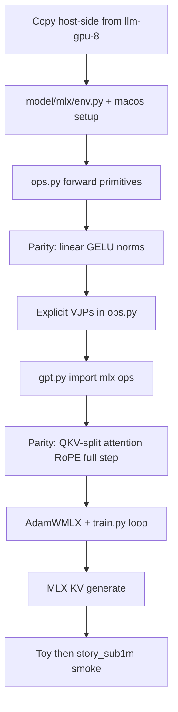

# M3 Air port of llm-gpu-8 (MLX, manual backward)

Source of truth: [github.com/dtelcore/llm-gpu-8](https://github.com/dtelcore/llm-gpu-8) v0.1.3. Target machine: MacBook Air M3, **8 GB unified memory**, fanless. **Process budget: never more than 2 GB** of unified memory at any time. Live path stays the Kepler contract:

```text
Training:   Dataset → Tokenizer → GPU forward → GPU loss → GPU manual backward → GPU AdamW
Generation: Prompt → Tokenizer → Prefill → KV cache → Incremental decode
```

NumPy remains the reference. **Do not** use `mx.value_and_grad`, `mlx.nn.Module`, or `mlx.optimizers` on the live path.

## Why this is a rewrite of the device layer, not a fork of CUDA

Kepler used custom PyCUDA kernels because modern PyTorch CUDA wheels cannot run on CC 3.5. M3 has no CUDA. The analog of `model/cuda/ops.py` is **MLX primitives** (`mx.matmul`, `mx.softmax`, RMSNorm/RoPE math), not handwritten Metal shaders.

| Kepler (`model/cuda/`) | M3 (`model/mlx/`) |
|---|---|
| `pycuda.gpuarray` | `mx.array` (unified memory) |
| SourceModule kernels | MLX ops + explicit VJP functions |
| `to_device` / `to_host` + SyncMeter | `mx.array(np)` / `np.asarray(mx)` + `mx.eval` |
| NVML / driver-used VRAM | `mx.metal.get_active_memory()` / `get_peak_memory()` |
| CUDA Graph | later: `mx.compile` on the closed step function |
| ScratchPool | named `mx` buffer reuse + timeline hooks |

Lock: **same op names and shapes as** [`model/cuda/ops.py`](https://github.com/dtelcore/llm-gpu-8/blob/main/model/cuda/ops.py) so [`model/gpt.py`](https://github.com/dtelcore/llm-gpu-8/blob/main/model/gpt.py) (`forward_batch`, `backward_batch_gpu`, generate KV) stays mostly import-swapped.

Do **not** use `mx.fast.scaled_dot_product_attention` / `mx.fast.rms_norm` on the train path — those hide the math we must VJP by hand. Forward = composed primitives; backward = the same formulas already in `gpt.py` (`_gelu_grad`, `_rmsnorm_backward`, `_layernorm_backward`, `_rope_np`).

## 8 GB Air + 2 GB process budget

The machine has 8 GB unified memory; macOS + display + Cursor typically consume several GB. This port **must not use more than 2 GB** of unified memory at any time (weights + activations + ScratchPool + KV + optimizer states). Kepler presets still fit; do not add 100M+ presets.

- **Hard abort:** if reported process use exceeds **2 GB**, stop (do not continue the step)
- **Soft machine guard:** abort if reported use exceeds **5.5 GB** — last-resort protection for the 8 GB machine if counters lag (see caveat below)
- Daily default: `story_sub1m` (C=128, L=4, T=128, batch 8, accum 2, ~0.83M)
- Also keep: `toy`, `tiny_stories` (~3M), `chat_5m` (~5M)
- BiggerTest-class (C=256, T=256, batch 4, ~844 MB on GT 730) should still fit under 2 GB
- Fanless: long GEMM runs will thermal-throttle; document “lid open, low brightness, don’t expect GT 730 tok/s to scale linearly with wall-clock over hours”

### Memory counter caveat

`mx.metal.get_active_memory()` / `get_peak_memory()` are the **primary signal** and the 2 GB abort uses them. They can **lag or under-count**. Design still sizes ScratchPool / KV arenas / batch so the *true* footprint stays ≤ 2 GB; the **5.5 GB** check is a soft machine-level backstop, not the training budget.

### Lazy evaluation (`mx.eval` everywhere Kepler synced)

MLX is lazy. Any Kepler site that implicitly synced (PyCUDA `to_host`, logging a scalar, checkpoint `weights.npz`, quality trial, generate sample, probe) needs an **explicit** `mx.eval` (or a small helper, e.g. `ops.eval_for_host(*arrays)`) **before** reading values on the host.

Required call sites (non-exhaustive; grep Kepler `to_host` / `sync_to_host` / `get()` when porting):

- After AdamW, before reading loss / `grad_norm` / `param_norm` / tok/s
- Before checkpoint serialize
- Before quality trial / generate probe / compare-quarters
- Before parity `np.asarray` comparisons
- Before `--trace-*` dumps

Do not sprinkle extra `mx.eval` on the hot path when metrics are off — same Stage 3.1 rule: no extra syncs unless the value is about to cross to host.

## What lands in this workspace

Empty folder [`/Users/it/dev/Apple MLX`](/Users/it/dev/Apple MLX). Implementation = copy host-side from llm-gpu-8, **delete** `model/cuda/`, Windows PowerShell/CUDA 10.1 setup, NVML, CUDA Graph. New device package `model/mlx/`.

```text
Apple MLX/
├── train.py  auto_train.py  generate.py  interactive.py
├── cli_common.py  paths.py  logging_config.py
├── model/
│   ├── config.py  gpt.py  layers.py  weights.py  trace.py   # from llm-gpu-8
│   └── mlx/                                                # NEW
│       ├── env.py          # metal.is_available(), 2 GB abort + 5.5 GB soft guard
│       ├── ops.py          # forward + manual VJPs + eval_for_host (cuda/ops.py API)
│       ├── kv_cache.py     # device K/V arenas for generate
│       └── allocator.py    # ScratchPool analog + timeline hooks
├── training/               # checkpoint, dataset, loss, quality; AdamWMLX
├── tokenizer/  setup/  tests/parity/  tools/tracing/
├── setup/1_macos_setup.sh  setup/2_test_workspace.py
└── data/  output/
```

Python **3.11 or 3.12** venv. Pin a **recent stable MLX** in `requirements.txt` (the `mx.metal.get_*_memory` APIs exist in current stable; do not float to unreleased nightlies). Deps: `mlx`, `numpy` (matplotlib only for plotters).

## MLX op surface to implement (parity order)

Mirror Kepler’s suite in [`tests/parity/`](https://github.com/dtelcore/llm-gpu-8/tree/main/tests/parity). Tolerances stay `rtol=1e-4`, `atol=1e-5`; NaN/Inf fail first. Tiny shapes.

1. **Linear** — `matmul` / `matmul_bias` + `linear_backward` (`dX = dY @ W.T`, `dW = X.T @ dY`, `db = sum`)
2. **GELU** — tanh approx (same constants as Kepler `0.79788456` / `0.044715`) + `gelu_backward`
3. **LayerNorm / RMSNorm** — forward with cache (`xhat`, `inv`/`inv_rms`) + existing host VJPs on `mx.array`
4. **Causal MHA + RoPE** — **QKV-split only** (no full `[B·T, 3C]` buffer). Parity tests must exercise `linear_qkv_split` / split-heads, **not** a naïve fused 3C matmul that would pass while the memory-saving path is untested.
5. **Embedding + CE** — `embedding_lookup_tokens`, `embed_backward`, `cross_entropy` on device
6. **Full step** — `forward_batch` → CE → `backward_batch_gpu` → `adamw_update` vs NumPy `backward_batch` / host AdamW
7. **Generate KV** — prefill pack, row append, decode attn; **argmax / top-k stay device**; **top-p stays host** (same as Kepler Stage 4)

Live training flag in `gpt.py`: keep `_GPU_TRAINING = True` but point at `model.mlx.ops`. NumPy `backward_batch` stays for `--cpu-check` / parity.

AdamW: port [`training/gpu_optimizer.py`](https://github.com/dtelcore/llm-gpu-8/blob/main/training/gpu_optimizer.py) to MLX (`m`, `v` as `mx.array`, cosine + warmup unchanged). Weights stay device-resident; checkpoint still writes `weights.npz` via a single `mx.eval` + host copy.

## CLI / UX to keep vs drop

Keep: `train.py --menu`, `auto_train.py`, `generate.py`, `interactive.py --chat`, BPE default / `--tokenizer char`, quarterly checkpoints, quality trial, `--runtime-metrics`, `--memory-timeline`, trace flags.

Drop or stub in v1:

- CUDA Graph / `--cuda-graph` → stub with “use `mx.compile` later”
- Process-vs-display VRAM split (no HDMI WDDM on Air)
- Windows `setup/1_new_workspace_setup.ps1` / CUDA 10.1 / MSVC
- Loading Kepler-trained `.npz` as a first-class path (weight layout *may* match; treat as a later experiment, not a gate)

macOS smoke:

```bash
python3 -m venv venv && source venv/bin/activate
pip install -r requirements.txt   # pinned mlx + numpy
python setup/2_test_workspace.py          # Metal device + 1 matmul + memory APIs
python -m tests.parity.run_parity
python auto_train.py --steps 20 --prompt "once upon a" --no-prompt
```

Default non-interactive recipe: `setup/story_sub1m_config.json` (same numbers as Kepler).

## Observability mapping

Reuse [`tools/tracing/runtime_metrics.py`](https://github.com/dtelcore/llm-gpu-8/blob/main/tools/tracing/runtime_metrics.py) with backends swapped:

- `device_used_mb` / peak ← `mx.metal.get_active_memory()` / `get_peak_memory()` (primary; may lag — log both active and peak; 2 GB abort + 5.5 GB soft guard)
- `sync_ms` ← time spent in `mx.eval` + `np.asarray` when metrics on (unified memory: should be tiny; still measure)
- ScratchPool timeline ← allocator alloc/reuse/clear (same JSONL schema)
- After each logged step: `mx.metal.reset_peak_memory()` so peaks are per-window

Off by default — same rule as Stage 3.1 (no extra evals/syncs unless flags set).

## Implementation order



1. Vendor host-side (CLI, tokenizer, setup presets, NumPy gpt helpers, tests). Strip CUDA imports.
2. `model/mlx/env.py` + `setup/2_test_workspace.py` (Metal available, device name, memory APIs, 2 GB helper).
3. `ops.py` forwards + ScratchPool + `eval_for_host`; parity linear/GELU/LN/RMS.
4. VJPs + `backward_batch_gpu` wired; parity **QKV-split** attention/RoPE/step (no fused 3C stand-in).
5. `AdamWMLX`, train loop, checkpoints.
6. Generate KV + `generate.py` / `interactive.py`.
7. Metrics/timeline; `guide.md` rewritten for M3 8 GB machine / **2 GB process budget** (not GT 730).
8. Freeze [`output/baselines/m3_air_8gb_story_sub1m.json`](output/baselines/m3_air_8gb_story_sub1m.json) after a short measured run (tok/s, step_ms, `device_used_mb`, peak, loss) — regression control like Kepler `stage31_baseline.json`.

## Out of scope (v1)

- Custom Metal kernel language / `mx.fast.custom`
- Autograd comparison harness (optional later, never the live path)
- `mx.compile` of the full train step (Stage 4 analog)
- Dropout (still unimplemented upstream)
- Multi-process / cluster; mlx-lm serving of HF models
