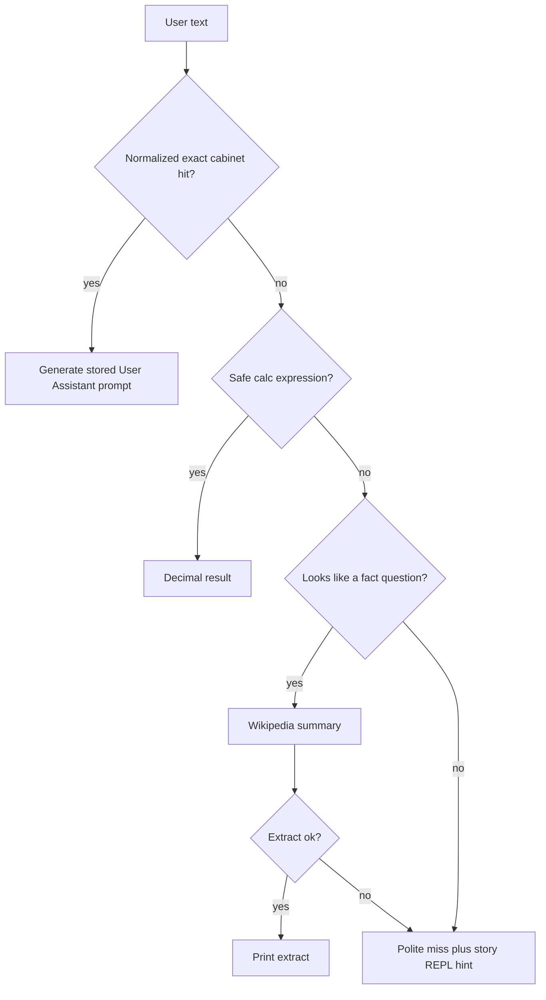

# Router + tools, then chat_facts_v5

One GPT cannot hold a cabinet, English, and tools as separate “folders.” The product split is a **Python router**. Weights stay a fact cabinet. English stays a **second process/checkpoint** (2 GB cap — never load two nets in one REPL).



Do **not** `combine: true`. Do **not** `--resume` v4. Do **not** overwrite `output/checkpoints/chat_facts_v4`.

Implementation order: cabinet index + tests → calc + tests → Wikipedia helper + mocked tests → `--router` in `interactive.py` → 0.0.7 docs → only then train v5.

## 1. Cabinet index (lookup, not generate)

New [`training/cabinet_index.py`](training/cabinet_index.py):

- Load [`data/chat_facts.jsonl`](data/chat_facts.jsonl) (override `--facts`).
- Store per fact: `normalized_key`, **exact trained user question**, **exact trained assistant**, and the generate prompt `User: {user} Assistant:` (canonical trained string, not the REPL typing).
- On hit, feed that **stored** prompt into `model.generate`.

**Normalise** (assert each in `tests/test_cabinet_index.py`):

- Strip leading/trailing whitespace
- Collapse internal whitespace
- Casefold
- Drop an optional trailing `?`
- Strip a leading `User:` if the user typed it
- No fuzzy / substring match (unobtanium must not hit layer-streaming)

Tests: France hit (including `what is the capital of france` without `?`); unobtanium miss; Neonics hit; typed `User: …` still hits; multi-answer impossible on this mix.

## 2. Calc tool (no eval)

New [`tools/calc.py`](tools/calc.py): AST walk of `+ - * / ** %` and unary `+/-`, numbers only, `decimal.Decimal`. Reject names, attribute access, calls. No `eval`.

**Cabinet wins over calc:** if the text is a cabinet key *and* looks arithmetic (`What is 0 factorial?`), route to cabinet. Implement as **cabinet first**, then calc.

Tests: `2+2` → 4; reject `__import__`; factorial question not stolen.

## 3. Search tool (Wikipedia, stdlib only)

[`requirements.txt`](requirements.txt) stays `mlx` / `numpy` / `matplotlib` / `tqdm`. Use `urllib` + Wikipedia:

- OpenSearch to resolve a title, then REST summary extract.
- Required `User-Agent`, short timeout, HTTPS only.

**Failure mode:** network error, HTTP error, or empty extract → **fall through to the polite miss**. Do not crash and do not invent an answer. Do **not** feed snippets back into the 6-layer net.

Tests: mock `urlopen` success (unobtanium → search); mock failure/empty → miss.

## 4. Wire into the REPL

Extend [`interactive.py`](interactive.py) with `--router` (default **on** when the checkpoint name looks like `chat` / `chat_facts`, off for story checkpoints). Flags (document in README + `py_calls.md`):

- `--facts PATH` (default `data/chat_facts.jsonl`)
- `--no-router` — today’s generate-every-turn behavior
- `--no-search` — skip network (then fact-shaped misses go straight to polite miss)
- Session: `:search q`, `:calc expr`, `:route` (print last decision)

Route order: **cabinet → calc → search → polite miss**. Cabinet generate uses the **stored** `User: … Assistant:` string, `model.generate` + `CHAT_STOP_STRINGS`, temperature **0.2**.

**English:** do not load a second checkpoint in this process. Miss path prints that open prose is `interactive.py --checkpoint <story> --no-router`. That is the 2 GB-safe split.

Leave `:learn` unimplemented.

## 5. Docs / version

Bump **0.0.7**: [`VERSION`](VERSION), [`CHANGELOG.md`](CHANGELOG.md), [`README.md`](README.md), [`py_calls.md`](py_calls.md) (`interactive.py --router`, calc/search, “do not combine”).

## 6. Train v5 (after router works on v4)

Mix is already correct: 9,580 docs = 479×20, `combine: false`, path [`data/chat_facts.jsonl`](data/chat_facts.jsonl) in [`setup/chat_facts_config.json`](setup/chat_facts_config.json).

```bash
python auto_train.py --config setup/chat_facts_config.json \
  --checkpoint output/checkpoints/chat_facts_v5 \
  --steps 1000 --run-budget 16000 --no-prompt --log-every 1 \
  --prompt "User: What is the capital of France? Assistant:" \
  --stop "User:"
```

Same C=512 L=6 T=256 stream recipe. Expect weaker recitation than v4 (105×300). **Keep v4.**

Probe via router + generate (exact lines):

- France → Paris, hydrogen → 1, Neonics → trained sentence
- `2+2` → calc 4
- `What is unobtanium` → Wikipedia, not `layer_strategy=stream`

If France is not Paris on v5, default `--checkpoint` stays **v4**; shrink packs later (drop health/maths first). Do not resume v5 into a tighter mix (BPE will differ).

## Out of scope this pass

- `combine: true` / multi-dataset weighted loader
- Dual-model Metal residency
- Model-emitted `<tool>…</tool>` training traces
- DuckDuckGo / browser
- Raising the 2 GB budget
