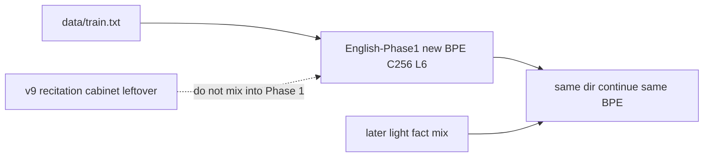

# Two-phase generalization (Phase 1 now, fact inject later)

v9 is a recitation cabinet (96% generate exact). Phase 1 must not see `chat_facts_v*.jsonl` or `make_fact_mix.py`. Product chat stays [`output/checkpoints/chat_facts_v7`](output/checkpoints/chat_facts_v7). Do not Load v8/v9.

## Corrective anchors (already true in this tree)

- **FFN is 4×C.** [`model/weights.py`](model/weights.py) `mlp_expand` is `(C, 4*C)`. No 1:1 FFN to fix. C=256 L=6 (~6M) fits the **2 GB** cap.
- **Weight decay is on.** AdamW `weight_decay=0.01` in [`training/gpu_optimizer.py`](training/gpu_optimizer.py). Do not rewrite the optimizer.
- **`dropout_prob>0` does nothing.** VJP kernels have no dropout. Leave `0.0`.
- **Do not `combine` `data/*.txt`.** Dataset name `data_dir` concatenates every txt, including cabinet mixes. Pin `path` and `"combine": false`.

## Corpus

| File | Role | Phase 1 |
|------|------|---------|
| [`data/train.txt`](data/train.txt) (~1.53M lines, ~197MB) | Plain wiki-style prose | **Sole input** |
| [`data/chat_train.txt`](data/chat_train.txt) | Same wiki as `User:/Assistant:` | **Exclude** |
| `data/chat_facts_v*.jsonl` | 300× cabinet | Phase 2 later, light, not 300× |

Loader already supports `dataset.path` ([`setup/dataset_setup.py`](setup/dataset_setup.py)). No new ingest script.

## 1. Recipe — [`setup/english_phase1_config.json`](setup/english_phase1_config.json)

Flattened sketch maps onto this repo’s recipe shape (copy structure from [`setup/story_c256_l6_config.json`](setup/story_c256_l6_config.json)):

- model: `embedding_dim` 256, `num_layers` 6, `num_heads` 8, `max_len` 256, `residual_scale` true, `dropout_prob` 0.0, `layer_strategy` resident (story recipe), name not `chat_*` so router stays off
- dataset: `"name": "train"`, `"path": "data/train.txt"`, `"combine": false`, `"tokenizer": "bpe"`, `"bpe_merges": 4000` (`vocab_size` null until BPE)
- hyperparameters: `learning_rate` 0.0003, `weight_decay` 0.01, batch/accum/warmup from the story recipe (B=4 accum=4 warmup=1000 unless autoscale shrinks)

## 2. Policy — [`setup/unguided_phase1_policy.json`](setup/unguided_phase1_policy.json)

Real keys (not a new `teacher_forced_loss_below` field):

- `max_steps`: 10000
- `eval_every`: 50 (or 25)
- `remix_if.after_steps`: 999999, `cabinet_exact_match_below`: 0 so cabinet exact cannot abort
- `probe_on_stop`: true
- `probe_mode`: `"english"` (new; default remains cabinet for v7/v9 policies)
- hard limits unchanged (no v4/v6 dir, no cross-BPE resume, abort NaN/spike)

Mid-train eval stays **val_loss / val_ppl** only ([`training/unguided/eval_suite.py`](training/unguided/eval_suite.py)): if `probe_mode==english`, skip France/Paris teacher-forced anchors and router fixture.

## 3. Stop probe — English OOD, not cabinet keys

When policy `probe_mode` is `english`, do not run stored `User:` cabinet generate. Add a small path in [`training/unguided/prober.py`](training/unguided/prober.py) (same Metal, `model.generate`, temp ~0.8 for prose):

```text
PHASE1_OOD_PROMPTS = [
    "Once upon a time in a valley",
    "Photosynthesis is a process where plants",
    "The lost city of Atlantis was rumored to",
    "A steam engine train traveled down the tracks",
    "Deep beneath the ocean surface, scientists discovered",
]
```

Generate ~12 new tokens per prompt. Success: cohesive English continuation. Fail: cabinet dump (Paris/Belgium/Rotavirus/`User:`). Write `output/runs/English-Phase1/generate_probe.md`. `decide_next_step` for english mode: do not flag `change_data` from intended capital-pair shares; primary is more_steps vs hold from val + whether OOD looks like English.

Do not implement kernel dropout or token masking in this pass.

## 4. Train (not started until you run it)

App must not have a checkpoint Loaded. Fresh dir + fresh BPE. Do not `--resume` v9.

```text
venv/bin/python unguided_trainer.py \
  --config setup/english_phase1_config.json \
  --policy setup/unguided_phase1_policy.json \
  --name English-Phase1 \
  --log-every 1
```



| Asset | Action |
|-------|--------|
| `output/checkpoints/chat_facts_v7` | Product chat — keep until Phase 2 exists |
| v9 weights | Recitation baseline — do not resume |
| `data/train.txt` | Phase 1 only corpus |
| `data/chat_train.txt` | Exclude from Phase 1 |

## Phase 2 preview (not this train)

After Phase 1 hits `max_steps`, inject facts with **`train.py` / `auto_train.py --resume`** into `output/checkpoints/English-Phase1` (same C/L/T/BPE). Light mix, not 300×. Unguided kernel still refuses existing `weights.npz` — do not use it for inject.

## Keep / don’t

- No FFN widen, no optimizer rewrite, no kernel dropout
- No `combine: true`
- Token masking deferred
