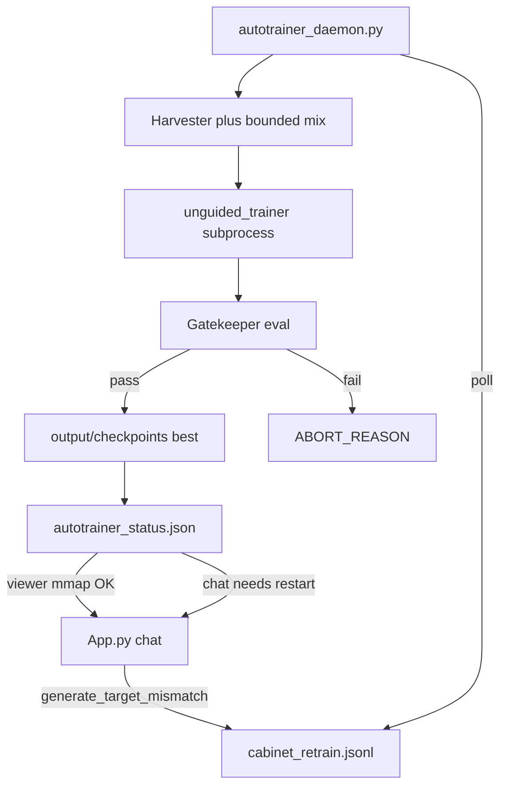
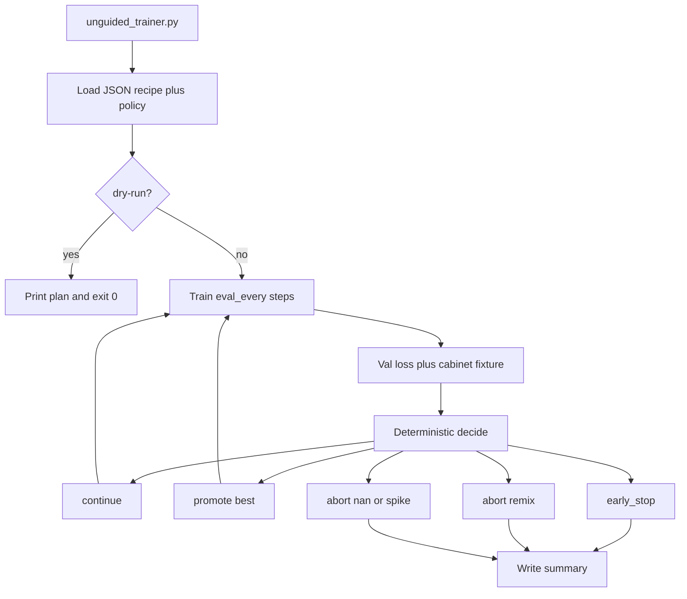

# 0.0.9 unguided trainer + autotrainer daemon

`auto_train.py` is already train-then-smoke. It is not autonomous: missing flags still prompt unless `--no-prompt`, and after train it only generates one sample. `train.py` still has `--menu`, quality-trial promotion prompts, and length/model questions. Leave those surfaces and `App.py` chat as interactive.

**Todo 1 (do this first):** bump [`VERSION`](/Users/it/dev/Apple MLX/VERSION) from 0.0.8 to **0.0.9** and add a `## 0.0.9` heading in [`CHANGELOG.md`](/Users/it/dev/Apple MLX/CHANGELOG.md). Do not overwrite the existing 0.0.8 notes. Then implement the kernel and daemon below.

## Locked two-process shape

| Process | Role | Notes |
|---------|------|-------|
| `unguided_trainer.py` | Unattended **kernel** | Pure train/eval/decide. No `input()`. Remix aborts with `NEXT_MIX.json` + `ABORT_REASON`. Fresh dir + fresh BPE only. |
| `autotrainer_daemon.py` | Harvester + launcher | Polls `cabinet_retrain.jsonl`, builds a **bounded** mix (queued entities + Paris/Cubitt/streaming/how-to anchors only), spawns the kernel as an isolated Metal subprocess, gates on anchors + harvested queue, calls `promote_best`, writes `output/autotrainer_status.json`. |

**Kept:** poll mismatch log, never stdin; bounded variants; isolated Metal child; spike/plateau/wall-clock abort; gate before promote; status file for the UI.

**Rejected:** chat hot-reload; `--resume` v7 into a perturbed mix; `models/v8_active.ckpt`; hard-coded `batch_size: 16` / `lr: 0.001`; 100%/0.92/cosine gates on day one.

`auto_train.py` and `App.py` remain the interactive/guided surfaces (App gets only a status read, no Metal hot-swap).

## Starter zip

[`Grokfiles/Apple_MLX_0.0.9_unguided.zip`](/Users/it/dev/Apple%20MLX/Grokfiles/Apple_MLX_0.0.9_unguided.zip) is a **partial overlay**, not a drop-in tree. It contains stubs for `training/unguided/{__init__,decide,session,loop,eval_suite}.py`, `unguided_trainer.py`, `autotrainer_daemon.py`, `setup/unguided_v7_policy.json`, and `tests/test_unguided_decide.py`.

Adapt those files into this repo. Do **not** replace this project's `CHANGELOG.md` / `py_calls.md` / `data/cabinet_binding_eval.jsonl` with the zip copies (they are short stubs). Fix zip mismatches before merge:

- Daemon anchors include `Who invented the printing press?` — that is **not** a trained cabinet key here. Use Paris, Cubitt, sequential layer streaming, disable/force how-tos.
- `session.py` / `loop.py` must call existing `train.py` helpers (`build_tokenizer_and_config`, `apply_train_plan`, the real step body). The zip wrappers are sketches.
- Retrain JSONL fields here are `typed_question` / `canonical_question` / `classification` as written by [`training/chat_session.py`](/Users/it/dev/Apple%20MLX/training/chat_session.py), not a `ts` cursor unless we add one. Harvest by byte offset or processed-id set.

Two new processes:

- [`unguided_trainer.py`](/Users/it/dev/Apple MLX/unguided_trainer.py) — one launch, one fresh train, no stdin (the **kernel**).
- [`autotrainer_daemon.py`](/Users/it/dev/Apple MLX/autotrainer_daemon.py) — poll [`output/cabinet_retrain.jsonl`](/Users/it/dev/Apple MLX/output/cabinet_retrain.jsonl), build a mix, spawn the kernel in a **subprocess**, gate, promote, signal.



## Hard constraints

- Not YAML. Recipe JSON + policy JSON only.
- Not mid-run remix with a new BPE. Inside one kernel process, remix **aborts** and writes `NEXT_MIX.json`. The daemon may start a **new** subprocess on that mix. Never `--resume` v7 (or any other BPE) into it.
- Not a second Metal process. The daemon must not spawn train while App / interactive / train holds Metal. Viewer mmap of promoted `weights.npz` is safe beside idle chat. **Chat generate cannot hot-swap** — App already restarts on checkpoint switch. There is no in-process Metal reload.
- Not `models/v8_active.ckpt`. Promote under [`output/checkpoints/`](/Users/it/dev/Apple MLX/paths.py) with existing [`promote_best`](/Users/it/dev/Apple MLX/training/checkpoint.py).
- Not hardcoded 100% fixture / 0.92 binding / 0.50 cosine on day one. Gate v1: anchors (Paris, Cubitt, sequential layer streaming, disable/force exact keys) plus zero new swaps on the harvested queue. Tighten after a measured baseline.
- Manifest `batch_size: 16` / `lr: 0.001` is not the v7 2 GB recipe. Defaults come from [`setup/chat_facts_v7_config.json`](/Users/it/dev/Apple MLX/setup/chat_facts_v7_config.json) + autoscale. Policy may set `max_steps` and spike ratio; it may not raise the 2 GB cap.
- Not infinite paraphrases of the whole cabinet. Perturb **only** harvested mismatch entities plus a fixed anchor slice.
- Not turning `auto_train.py` into the daemon.



## 1. Extract library primitives

Do not copy the 600-line `train()` body. Slice three callables out of [`train.py`](/Users/it/dev/Apple MLX/train.py) / [`training/eval.py`](/Users/it/dev/Apple MLX/training/eval.py) / [`tools/eval_cabinet_bindings.py`](/Users/it/dev/Apple MLX/tools/eval_cabinet_bindings.py):

- `training/unguided/session.py`: `build_train_session(args) -> TrainSession` wrapping the existing tokenizer, `GPTModel`, AdamW, `WindowedDataset`, val split, and memory plan. Forces `args.no_prompt = True`.
- `training/unguided/loop.py`: `train_segment(session, steps) -> TrainMetrics` (loss, ppl, grad_norm, nan flag). Reuse the current step body.
- `training/unguided/eval_suite.py`: `run_eval_suite(session, policy) -> EvalResults` with (a) existing `evaluate_val_loss`, (b) **router-only** fixture via current `eval_router` (no Metal extra), (c) optional teacher-forced ranks on a **small** labeled subset using the already-loaded model (no second checkpoint load). Skip Q/K cosine and attention entropy.

`train.py` and `auto_train.py` keep calling `train()` as today.

## 2. Policy + entry point

Add [`setup/unguided_v7_policy.json`](/Users/it/dev/Apple MLX/setup/unguided_v7_policy.json) (name can track the recipe, not a fake 0.0.8 yaml):

- `recipe`: `setup/chat_facts_v7_config.json` (or CLI override)
- `checkpoint`: `output/checkpoints/unguided_v7` (fresh dir; refuse if it looks like a v6/v4 resume)
- `max_steps`, `eval_every`, `max_wall_s`, `early_stop_patience`
- `loss_spike_ratio` (e.g. 2.0 vs recent median)
- `promote_on`: improve val_loss (and later cabinet exact-match once measured)
- `remix_if`: cabinet exact-match below a **placeholder** after N steps — action is abort+next-mix, not rebuild in-process
- `hard_limits` always on, including `--unguarded`

Add [`unguided_trainer.py`](/Users/it/dev/Apple MLX/unguided_trainer.py):

```text
python unguided_trainer.py --config setup/chat_facts_v7_config.json --policy setup/unguided_v7_policy.json
python unguided_trainer.py --config ... --policy ... --dry-run
python unguided_trainer.py --config ... --policy ... --unguarded
```

`--unguarded` only relaxes data hygiene (skip quarantine on a **declared** next-mix recipe) and allows overwriting `latest/` more aggressively. It still cannot skip hard limits, NaN abort, or stdin. It still cannot `--resume` a different BPE.

`--dry-run` prints resolved recipe, param estimate, eval_every, stop rules, and exits 0 with **no Metal init**.

## 3. Decision engine

[`training/unguided/decide.py`](/Users/it/dev/Apple MLX/training/unguided/decide.py): pure function, fully unit-tested.

Actions: `continue` | `promote` | `early_stop` | `abort_spike` | `abort_remix` | `stop_limit`.

Rules (v1):

- NaN / non-finite loss → `abort_spike`
- loss > `loss_spike_ratio` × median of last K evals → `abort_spike`
- val_loss is the best so far → `promote` (then continue unless at max_steps)
- no val_loss improvement for `early_stop_patience` evals → `early_stop`
- remix predicate true → `abort_remix` (write `output/runs/<name>/NEXT_MIX.json` pointing at `make_fact_mix.py` args; do not run the mix)
- `max_steps` / `max_wall_s` → `stop_limit`

Every decision appends one line to `output/runs/<run_name>/decisions.jsonl`. Abort writes `ABORT_REASON` and exits 1.

Promote uses existing [`promote_best`](/Users/it/dev/Apple MLX/training/checkpoint.py). Never overwrite `best/` on a worse metric. `latest/` updates every eval.

## 4. Data and cabinet (kernel default)

Reuse [`drop_quarantined`](/Users/it/dev/Apple MLX/training/cabinet_index.py) and the mix already on disk. The kernel does not call `make_fact_mix` unless `--prepare-mix` is set (still non-interactive, still before Metal). Eval fixture: [`data/cabinet_binding_eval.jsonl`](/Users/it/dev/Apple MLX/data/cabinet_binding_eval.jsonl).

## 5. Daemon Phase 1 — harvester and mix

[`training/unguided/harvest.py`](/Users/it/dev/Apple MLX/training/unguided/harvest.py):

- Poll / parse `output/cabinet_retrain.jsonl` (persisted offset in `output/autotrainer_state.json`).
- Deduplicate by normalized question **and** skip consumed/poison keys globally (re-appended mismatches do not start another train).
- Keep `BINDING_ENTITY_SWAP` and `TARGET_MISMATCH` only.
- Truncate clamps the cursor; it does not reset to 0 and replay. Poison/consumed keys still filter a rotated log.
- Require `min_retrain_queue_size` (policy, default 5) before a cycle; cap at `max_retrain_queue_size`.
- Emit a **bounded** mix via existing [`tools/make_fact_mix.py`](/Users/it/dev/Apple MLX/tools/make_fact_mix.py):
  - **retrain slice:** harvested expected answers, plus a small closed set of prompt variants (active/passive inventor, article form). Not open-ended generation.
  - **anchor slice:** Paris / Cubitt / sequential layer streaming / disable+force how-tos / user_facts (forgetting guard).
  - **broad slice:** existing clean v7 rows minus quarantine.
- Weights from [`setup/autotrainer_config.json`](/Users/it/dev/Apple MLX/setup/autotrainer_config.json) (`retrain_queue_weight` / `clean_anchor_weight` / `broad_corpus_weight`).
- Write `data/chat_facts_unguided.jsonl` + a fresh recipe that points at it. New BPE. Child train is **from scratch**.
- Quarantine stays on unless `--unguarded`.

## 6. Daemon Phase 2 — subprocess supervisor

[`training/unguided/supervisor.py`](/Users/it/dev/Apple MLX/training/unguided/supervisor.py) + [`autotrainer_daemon.py`](/Users/it/dev/Apple MLX/autotrainer_daemon.py):

- One child: `python unguided_trainer.py --config <fresh recipe> --policy ... --no-prompt` (implied).
- Process exit releases Metal. Parent never imports `model.gpt`.
- Refuse to spawn if another Metal holder is marked busy in `output/autotrainer_status.json` or if `--require-idle-app` (default on).
- Traps: loss spike (`loss_spike_ratio`, policy default 3.0× median), plateau (`delta < 0.001` over N steps, configurable), non-zero child exit, wall clock. Kill child; write `ABORT_REASON`.
- **Containment** ([`training/unguided/containment.py`](/Users/it/dev/Apple MLX/training/unguided/containment.py)): on NaN/spike/nonzero/124, poison that harvest block, advance the cursor, exponential backoff (`crash_backoff_s` → `backoff_max_s`). Cap `max_trains_per_hour` (default 2). Gate-fail keeps the rows for `max_gate_retries` (default 2) then poisons. Do not relaunch the same crashed mix.
- 2 GB cap remains in [`training/memory_controller.py`](/Users/it/dev/Apple MLX/training/memory_controller.py). `metal_memory_limit_mb` in the manifest is documentation / preflight only — cannot raise the hardcoded budget.

## 7. Daemon Phase 3–4 — gatekeeper and signaling

Gate (child already ran `run_eval_suite`; daemon re-reads the JSON summary):

1. Anchor fixture exact-match (Paris, Cubitt, sequential layer streaming, both how-tos).
2. Harvested queue: generated text matches stored target (or teacher-forced rank-1 on the expected first tokens).
3. No new `BINDING_ENTITY_SWAP` on that queue.

On pass: `promote_best` into `output/checkpoints/unguided_<stamp>/best`. Write [`output/autotrainer_status.json`](/Users/it/dev/Apple MLX/output/autotrainer_status.json): `{state, checkpoint, weights, promoted_at, needs_chat_restart: true}`.

App.py changes (small): poll or show that status. Viewer can mmap the new `weights.npz` without Metal. Chat **must restart** the process to load the new net — same as today's selector. Do not claim hot-reload of generate.

On gate fail: leave `best/` untouched; keep the retrain rows for up to `max_gate_retries` cycles (with backoff); then poison those keys. On child crash: poison the harvest ids immediately and do not relaunch that block.

## 8. Manifest

[`setup/autotrainer_config.json`](/Users/it/dev/Apple MLX/setup/autotrainer_config.json) holds daemon poll/queue/mix weights and gate names. Training hyperparameters stay in the recipe JSON. Do not copy the sketch's `batch_size: 16` / `learning_rate: 0.001` into a live v7-sized run.

## 9. Tests and version

- Unit tests for `decide()` (spike, patience, promote, remix-abort, wall-clock).
- Harvester: dedupe, quarantine, variant generation, min-queue no-op, skip poison keys.
- Containment: crash poisons the block + backoff; gate-fail keeps then poisons; max trains per hour; truncate does not replay.
- Dry-run: no `mlx` device required (kernel and daemon `--dry-run`).
- Supervisor: refuse spawn when status says Metal busy (mocked).
- Gate: fail closed if anchors miss; do not promote.
- Refuse `--resume` when recipe `dataset.path` / vocab fingerprint disagrees with the checkpoint.
- Update [`CHANGELOG.md`](/Users/it/dev/Apple MLX/CHANGELOG.md), [`VERSION`](/Users/it/dev/Apple MLX/VERSION), and rows in [`py_calls.md`](/Users/it/dev/Apple MLX/py_calls.md) for both entry points.

First Metal check (after the user **stops App**): kernel `--dry-run`, then a short guarded kernel run into a **new** dir. Daemon cycle only after that. Do not `--resume` v6/v7 into the new mix.