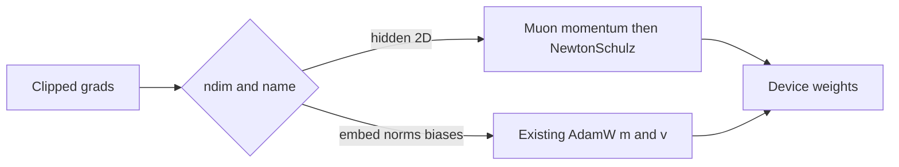

# Muon + AdamW hybrid

AdamW stays the default. Muon is a second update rule for the hidden matrices only, selected by the recipe. The step-500 and step-1000 smoke stays on AdamW. A hybrid run is a fresh init, because the momentum buffer is not Adam's `m`/`v` and this repo does not restore optimizer state on resume.

## Where each tensor goes

Hidden matrices are almost all of the layer weights (`12 C^2` per layer in [model/weights.py](model/weights.py)). Those four names, per layer, take Muon:

- `qkv_proj` `(C, 3C)`
- `attn_out_proj` `(C, C)`
- `mlp_expand` `(C, 4C)`
- `mlp_contract` `(4C, C)`

AdamW keeps everything else, including the tied `token_embedding` / `lm_head` even though that matrix is 2D: `final_ln_gamma`, every `*_bias`, every `ln*_gamma`. RMSNorm gammas are vectors. Biases are vectors.

At C=1024 the largest Muon matrix is `mlp_expand` / `mlp_contract` at 1024 by 4096. Newton-Schulz runs on the short side, so the Gram matrix is 1024 by 1024, not 4096 by 4096.

## What one Muon step does

Same place as today's Adam step, [model/mlx/ops.py](model/mlx/ops.py) `adamw_update` and [training/gpu_optimizer.py](training/gpu_optimizer.py) `AdamWGPU._update_keys`.

- One momentum buffer, coefficient 0.95, Nesterov. No second-moment `v` for those keys.
- Five-step Newton-Schulz quintic (the standard coefficients) so the update is approximately orthogonal, then scaled by `sqrt(max(rows, cols))` so the learning rate means a similar thing on `(C, C)` and `(C, 4C)`.
- Decoupled weight decay stays on the weight, same idea as the `wd` term already in `adamw_update`.
- Global grad clip in `clip_grads_` stays in front of both updates, so the AdamW subset is unchanged.
- Streaming already loads one block, updates it, and stashes moments on the host (`step_layer` / `_stash_moments`). Muon uses that path with one host buffer instead of `m` and `v`.

Memory planner in [training/memory_controller.py](training/memory_controller.py) currently charges `2 * param_bytes` for Adam. Hybrid charge is `2 * adam_params + 1 * muon_params`. That is about half the optimizer state on the matrices, which are the bulk of the count. The 2 GB cap does not move.

## Learning rates

Do not reuse `0.0012` for the Muon matrices. An orthogonal step is already unit-scale, so that rate is far too small. Keep AdamW at the recipe's `0.0012` for embeddings, norms, and biases. Start Muon at `0.02` with momentum `0.95`, which is the usual small-GPT starting point, and confirm it on a short probe before any long run.

Each Muon step does extra matmuls. The win being aimed at is fewer steps to a story that keeps one name, not a shorter step. If a probe step is several times slower than the current ~10 s AdamW step and the loss is not clearly ahead by a few hundred steps, stop and do not launch a long hybrid run.

## Path

1. Pure-MLX `muon_update` beside `adamw_update`. Unit test: hidden keys move, a bias and `token_embedding` still take the Adam path, the update has no NaNs, and a tall matrix is orthogonalized on its short side.
2. Route keys inside `AdamWGPU` when the recipe says `optimizer: "muon"`. `optimizer: "adamw"` keeps today's step byte for byte. Streaming stash stores one buffer for Muon keys.
3. Adjust the memory estimate. Confirm the current C=1024, 6-layer, stream, batch 4, accum 16, T=256 recipe still fits.
4. New checkpoint directory. Do not `--resume` `english_tinystories_c512_l6_2000_smoke_b4_accum16`. Probe a few hundred steps, then compare a mouse continuation at step 500 and step 1000 with the AdamW quarters already saved: Tim-then-Lily at step 500, Max held for 160 tokens at step 1000 with the bad verb "suffer".
5. Only if that probe is ahead on name-holding or loss at the same step, point a fresh long run at the hybrid. The story gate is unchanged: one character and one object across the continuation, not a lower loss by itself.
